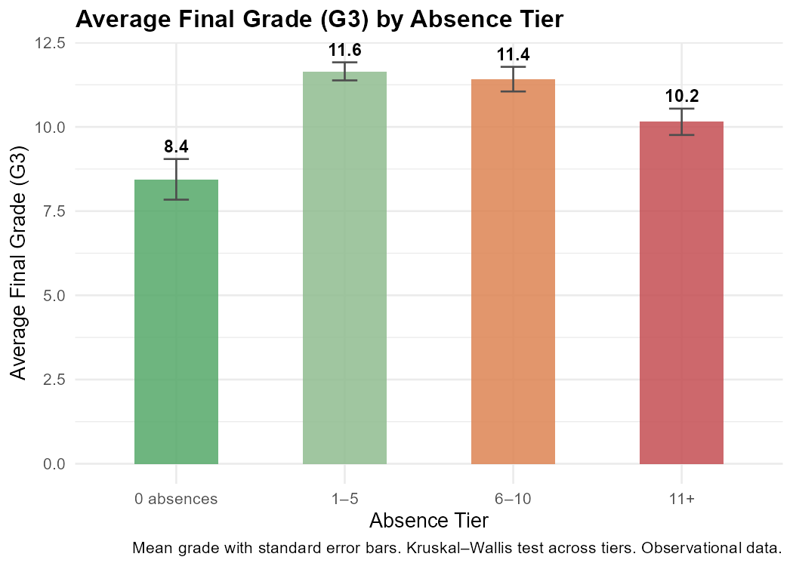

```{r}
#| label: setup
#| include: false
source("R/analyze_absences.R")
results <- analyze_absences()
```

## Overview

This section investigates how school absences relate to final grade performance (G3).
We segment students by absence tier, apply a Kruskal–Wallis test across tiers,
and fit a simple linear regression to estimate the per-absence association with G3.

> **Important context:** High absenteeism may be a *symptom* of underlying
> factors (illness, socioeconomic barriers, disengagement) rather than a simple
> cause of poor grades. Findings are observational.

---

## Absence Distribution

```{r}
#| label: absence-summary
abs_sum <- read.csv("data/outputs/tables/absence_summary.csv")
knitr::kable(abs_sum, col.names = c("Statistic", "Value"),
             caption = "Absence distribution summary statistics")
```

---

## Absences vs. Final Grade

```{r}
#| label: scatter
#| fig-cap: "Scatter plot of absences vs. G3 with OLS regression line. Coloured by risk status."
knitr::include_graphics("data/outputs/figures/absence_scatter.png")
```

---

## Absence Tier Analysis

```{r}
#| label: tier-table
tier_tbl <- read.csv("data/outputs/tables/absence_tier_summary.csv")
knitr::kable(tier_tbl,
             col.names = c("Tier", "N", "% of Total", "Median G3", "Mean G3", "% At Risk"),
             caption = "Grade outcomes and at-risk rates by absence tier")
```

```{r}
#| label: tier-plot
#| fig-cap: "Average final grade by absence tier"

```

---

## Key Findings

```{r}
#| label: regression-summary
lm_fit <- lm(G3 ~ absences,
             data = read.csv("data/processed/student_clean.csv",
                             stringsAsFactors = TRUE))
lm_sum <- summary(lm_fit)
cat(sprintf(
  "Linear regression G3 ~ absences:\n  Slope: %.3f (for each additional absence, G3 decreases by ~%.2f points)\n  R² = %.4f\n  p-value: %.4f",
  coef(lm_fit)[2], abs(coef(lm_fit)[2]),
  lm_sum$r.squared, lm_sum$coefficients[2, 4]
))
```

> The association between absences and G3 is statistically significant
> but the R² is low, indicating absences alone explain a small fraction of
> grade variance. Many other factors are at play.

---

*Continue to [Support Ranking](support-ranking.qmd) to see which students need help most urgently.*
