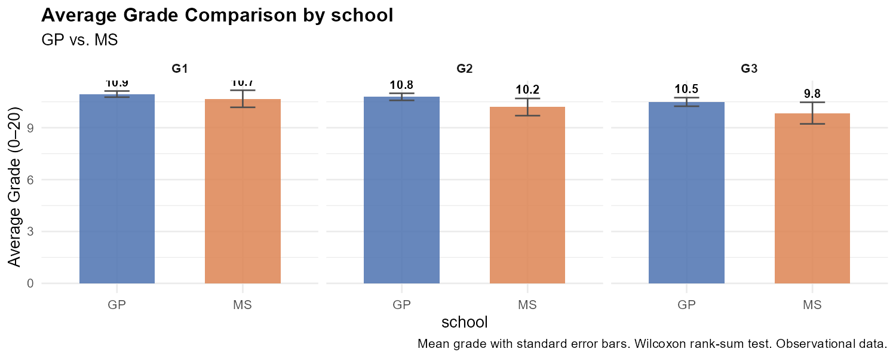
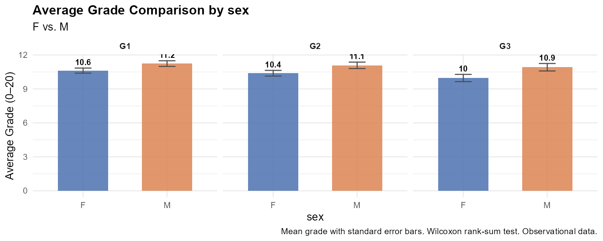
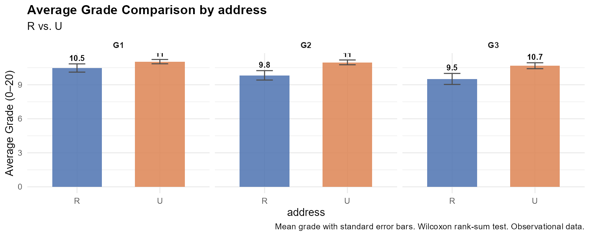

```{r}
#| label: setup
#| include: false
source("R/compare_study_groups.R")

# Run comparisons for three grouping variables
res_school  <- compare_study_groups(group_col = "school")
res_sex     <- compare_study_groups(group_col = "sex")
res_address <- compare_study_groups(group_col = "address")
```

## Overview

This section compares grade distributions between pairs of student groups using
**Wilcoxon rank-sum tests** (non-parametric, appropriate for ordinal/skewed grade data)
with Bonferroni correction for multiple comparisons. Effect sizes are reported
as **rank-biserial correlations** (r).

> **Observational data:** Group differences represent statistical associations
> within this sample. They do not establish causation.

---

## School: GP vs. MS

```{r}
#| label: school-plot
#| fig-cap: "Average grades for GP (Gabriel Pereira) vs. MS (Mousinho da Silveira)"

```

```{r}
#| label: school-results
knitr::kable(res_school[, c("outcome", "median_group1", "median_group2",
                             "p_value", "p_adj_bonferroni", "effect_size_r")],
             col.names = c("Outcome", "Median GP", "Median MS",
                           "p-value", "p (Bonferroni)", "Effect r"),
             caption = "Wilcoxon rank-sum test: GP vs. MS",
             digits = 4)
```

---

## Sex: Female vs. Male

```{r}
#| label: sex-plot
#| fig-cap: "Average grades for Female vs. Male students"

```

```{r}
#| label: sex-results
knitr::kable(res_sex[, c("outcome", "median_group1", "median_group2",
                          "p_value", "p_adj_bonferroni", "effect_size_r")],
             col.names = c("Outcome", "Median F", "Median M",
                           "p-value", "p (Bonferroni)", "Effect r"),
             caption = "Wilcoxon rank-sum test: Female vs. Male",
             digits = 4)
```

---

## Address: Urban vs. Rural

```{r}
#| label: address-plot
#| fig-cap: "Average grades for Urban vs. Rural students"

```

```{r}
#| label: address-results
knitr::kable(res_address[, c("outcome", "median_group1", "median_group2",
                               "p_value", "p_adj_bonferroni", "effect_size_r")],
             col.names = c("Outcome", "Median U", "Median R",
                           "p-value", "p (Bonferroni)", "Effect r"),
             caption = "Wilcoxon rank-sum test: Urban vs. Rural",
             digits = 4)
```

---

## Interpreting Effect Sizes

| r | Interpretation |
|---|---|
| 0.00 – 0.10 | Negligible |
| 0.10 – 0.30 | Small |
| 0.30 – 0.50 | Medium |
| > 0.50 | Large |

> Statistical significance (p < 0.05) does not guarantee practical importance.
> Always consider effect size and sample context together.

---

*Continue to [Model](model.qmd) to see which factors predict academic risk.*
