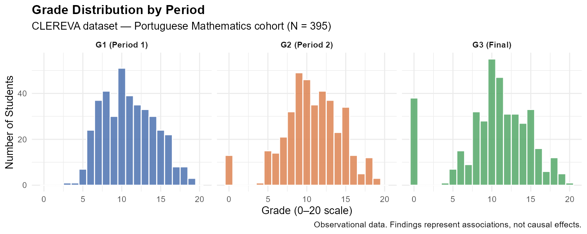
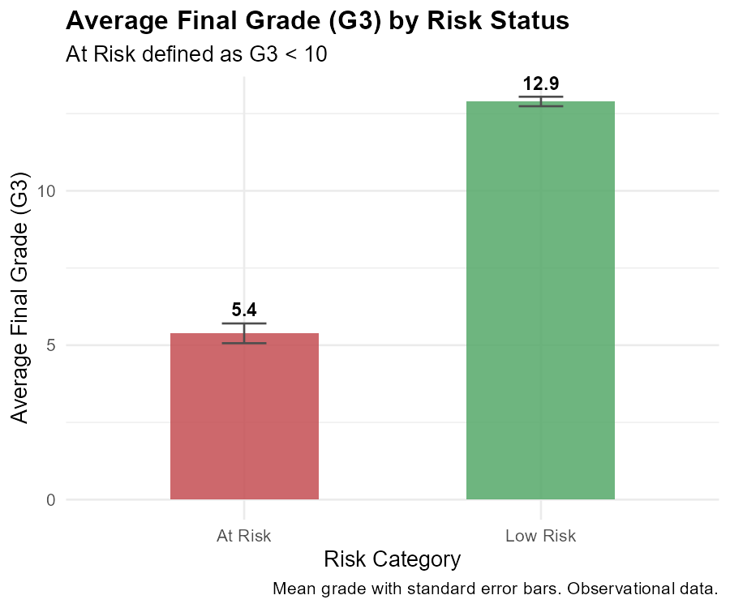
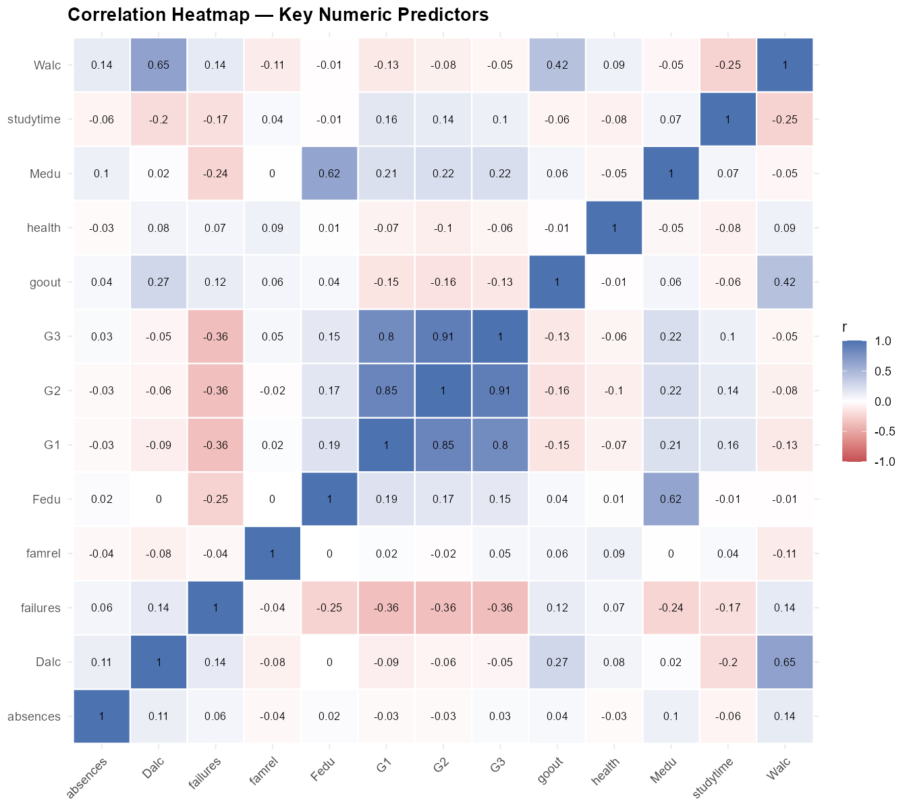

```{r}
#| label: setup
#| include: false
source("R/explore_performance.R")
results <- explore_performance()
```

## Overview

This page presents an exploratory data analysis (EDA) of the student performance
dataset. We examine grade distributions, identify the proportion of at-risk
students, and explore correlations between key predictors and final outcomes.

> **Observational data:** All findings represent statistical associations within
> this sample. No causal conclusions can be drawn.

---

## Summary Statistics

```{r}
#| label: summary-table
summary_tbl <- read.csv("data/outputs/tables/explore_summary.csv")
knitr::kable(summary_tbl,
             caption = "Descriptive statistics for numeric variables",
             digits = 2)
```

---

## Grade Distributions

The three period grades (G1, G2, G3) follow similar distributions.
A notable spike at zero reflects students who did not sit the examination.

```{r}
#| label: grade-dist
#| fig-cap: "Grade distribution across three assessment periods (0–20 scale)"

```

---

## At-Risk Breakdown

```{r}
#| label: risk-breakdown
#| fig-cap: "Final grade (G3) distribution by risk status. At Risk = G3 < 10."

```

```{r}
#| label: risk-counts
cat_tbl <- read.csv("data/outputs/tables/explore_categorical.csv")
risk_tbl <- cat_tbl[cat_tbl$variable == "at_risk", c("level", "count", "pct")]
knitr::kable(risk_tbl, col.names = c("Status", "N", "%"),
             caption = "Proportion of at-risk students in the sample")
```

---

## Predictor Correlations

```{r}
#| label: corr-heatmap
#| fig-cap: "Pearson correlation matrix across key numeric predictors"

```

**Key observations:**

- G1, G2, and G3 are strongly positively correlated — early grades predict later grades.
- `failures` (past course failures) shows the strongest negative association with G3.
- `studytime` shows a weak positive association with G3.
- Alcohol consumption (`Dalc`, `Walc`) and `goout` show modest negative associations.

> These are correlations in an observational sample. Association does not imply causation.

---

*Continue to [Compare](compare.qmd) to test for differences between student groups.*
