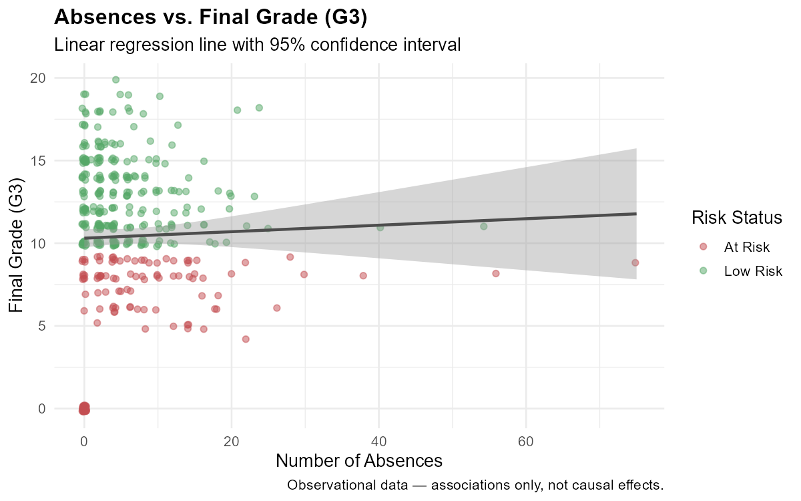

```{r}
#| label: setup
#| include: false
# Run full pipeline to ensure all outputs are current
source("R/import_data.R")
source("R/clean_data.R")
source("R/explore_performance.R")
source("R/compare_study_groups.R")
source("R/model_risk.R")
source("R/analyze_absences.R")
source("R/rank_support_priority.R")
source("R/scenario_analysis.R")
source("R/validation.R")

raw_df <- import_data()
clean_df <- clean_data(raw_df)
explore_performance()
compare_study_groups(group_col = "school")
model_risk()
analyze_absences()
rank_support_priority()
scenario_analysis(
    scenario = list(studytime = 4, schoolsup = "yes"),
    label = "increased_study_and_support"
)
scenario_analysis(scenario = list(absences = 0), label = "zero_absences")
```

## Summary

This report presents a reproducible data analysis of academic risk in Portuguese
secondary school Mathematics students (N = 395). Using the UCI Student Performance
dataset, we applied six statistical skills to (1) describe performance patterns,
(2) compare student groups, (3) build a logistic regression risk model,
(4) analyse attendance patterns, (5) generate a support priority ranking,
and (6) simulate intervention scenarios.

**Key findings:**

- `r round(mean(clean_df$at_risk == "At Risk") * 100, 1)`% of students are classified as At Risk (G3 < 10)
- Past failures (`failures`) is the strongest predictor of academic risk
- Students with 11+ absences have substantially higher at-risk rates
- Simulated full school support + high study time reduces risk for a meaningful
  proportion of currently at-risk students (see Section 6)

> All findings are **associational**, not causal. This is observational data.

---

## 1. Dataset

```{r}
#| label: dataset-summary
cat(sprintf(
    "Dataset: UCI Student Performance (Mathematics)\nN = %d students, %d variables\nAt Risk (G3 < 10): %d (%.1f%%)\nLow Risk (G3 >= 10): %d (%.1f%%)",
    nrow(clean_df), ncol(clean_df),
    sum(clean_df$at_risk == "At Risk"),
    mean(clean_df$at_risk == "At Risk") * 100,
    sum(clean_df$at_risk == "Low Risk"),
    mean(clean_df$at_risk == "Low Risk") * 100
))
```

---

## 2. Exploratory Data Analysis

```{r}
#| label: eda-summary
#| tbl-cap: "Descriptive statistics for key numeric variables"
summary_tbl <- read.csv("data/outputs/tables/explore_summary.csv")
knitr::kable(summary_tbl[summary_tbl$variable %in% c("G1", "G2", "G3", "absences", "failures", "studytime"), ],
    digits = 2
)
```

```{r}
#| label: eda-dist
#| fig-cap: "Grade distributions across three assessment periods"
#| out-width: "85%"
#| fig-align: center
knitr::include_graphics("data/outputs/figures/grade_distribution.png")
```

---

## 3. Group Comparisons

```{r}
#| label: compare-school
#| fig-cap: "Average grade comparison: GP vs. MS students"
#| out-width: "85%"
#| fig-align: center
knitr::include_graphics("data/outputs/figures/compare_school_bar.png")
```

```{r}
#| label: compare-results-tbl
res <- read.csv("data/outputs/tables/compare_results.csv")
knitr::kable(
    res[, c(
        "outcome", "group1", "group2", "median_group1", "median_group2",
        "p_adj_bonferroni", "effect_size_r"
    )],
    col.names = c(
        "Outcome", "Group 1", "Group 2", "Median 1", "Median 2",
        "p (Bonf.)", "Effect r"
    ),
    caption = "Wilcoxon test results: GP vs. MS (Bonferroni corrected)",
    digits = 4
)
```

---

## 4. Academic Risk Model

```{r}
#| label: model-metrics
metrics <- read.csv("models/model_metrics.csv")
knitr::kable(metrics,
    col.names = c("Metric", "Value"),
    caption = "Test set performance metrics",
    digits = 4
)
```

```{r}
#| label: roc-fig
#| fig-cap: "ROC curve — logistic regression risk model"
#| out-width: "85%"
#| fig-align: center
if (file.exists("data/outputs/figures/roc_curve.png")) {
    knitr::include_graphics("data/outputs/figures/roc_curve.png")
}
```

```{r}
#| label: predictor-fig
#| fig-cap: "Logistic regression coefficients by predictor"
#| out-width: "85%"
#| fig-align: center
knitr::include_graphics("data/outputs/figures/predictor_importance.png")
```

---

## 5. Absence Analysis

```{r}
#| label: absence-tier
#| tbl-cap: "Grade outcomes and at-risk rates by absence tier"
tier <- read.csv("data/outputs/tables/absence_tier_summary.csv")
knitr::kable(tier,
    col.names = c("Tier", "N", "% Total", "Median G3", "Mean G3", "% At Risk")
)
```

```{r}
#| label: absence-scatter
#| fig-cap: "Absences vs. final grade (G3) with regression line"
#| out-width: "85%"
#| fig-align: center

```

---

## 6. Scenario Analysis

```{r}
#| label: scenario-summary
s1 <- read.csv("data/outputs/tables/scenario_results_increased_study_and_support.csv")
s2 <- read.csv("data/outputs/tables/scenario_results_zero_absences.csv")

scenario_tbl <- data.frame(
    Scenario = c("Increased Study + School Support", "Zero Absences"),
    Students_with_Lower_Risk = c(sum(s1$delta_prob < -0.01), sum(s2$delta_prob < -0.01)),
    At_Risk_Transitioned = c(
        sum(s1$class_changed & s1$baseline_class == "At Risk"),
        sum(s2$class_changed & s2$baseline_class == "At Risk")
    ),
    Mean_Delta = round(c(mean(s1$delta_prob), mean(s2$delta_prob)), 4)
)
knitr::kable(scenario_tbl,
    col.names = c("Scenario", "↓ Risk Prob.", "At Risk→Low Risk", "Mean Δ Prob."),
    caption = "Summary of simulated intervention scenarios"
)
```

> Scenario results are model extrapolations — not causal predictions.

---

## 7. Limitations

1. Observational data — no causal inference possible
2. Single cohort (N = 395) from two Portuguese schools, 2005–2006
3. Self-reported predictors subject to response bias
4. Binary risk threshold (G3 < 10) is a policy choice, not a natural boundary
5. Model evaluated on same-cohort holdout, not prospective validation

---

## 8. Responsible Use

This project generates decision-support indicators for counsellors. All
outputs require human review before action. No personal identifiers are
stored or displayed. Students are represented by anonymised indices only.

---

*Generated on `r format(Sys.Date(), "%d %B %Y")` using CLEREVA v1.0.*
