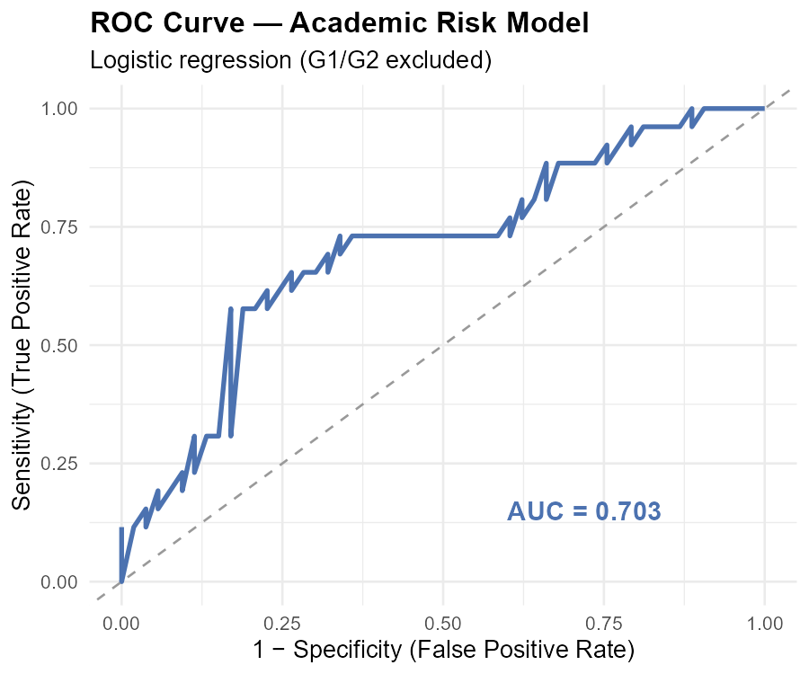
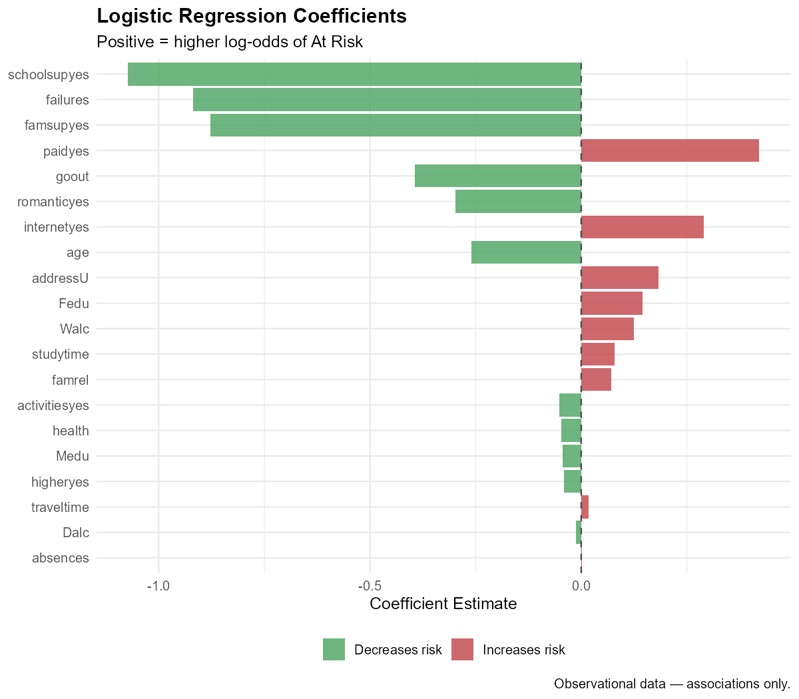

```{r}
#| label: setup
#| include: false
source("R/model_risk.R")
model_output <- model_risk()
```

## Overview

This section trains a **logistic regression model** to predict which students
are at risk of failing (final grade G3 < 10). The model uses sociodemographic
and behavioural predictors only — G1 and G2 are intentionally excluded to
avoid data leakage in an early-intervention context.

> **Predictive, not prescriptive:** Model outputs indicate statistical risk
> based on observed patterns. They are not deterministic decisions.

---

## Model Specification

- **Target**: `at_risk` (1 = G3 < 10, 0 = G3 ≥ 10)
- **Algorithm**: Logistic regression (`glm(..., family = binomial)`)
- **Split**: Stratified 80% train / 20% test (seed = 42)
- **Excluded**: G1, G2 (mid-year grades — data leakage risk)

**Predictors used:**

```{r}
#| label: predictors
cat(paste(c("failures", "absences", "studytime", "higher", "schoolsup",
            "Medu", "Fedu", "goout", "famrel", "health", "age", "address",
            "internet", "romantic", "paid", "famsup", "activities",
            "Dalc", "Walc", "traveltime"), collapse = ", "))
```

---

## Model Performance

```{r}
#| label: metrics-table
metrics <- read.csv("models/model_metrics.csv")
knitr::kable(metrics, col.names = c("Metric", "Value"),
             caption = "Test set performance metrics",
             digits = 4)
```

```{r}
#| label: roc-curve
#| fig-cap: "ROC curve on the test set. AUC > 0.5 indicates better-than-random discrimination."
if (file.exists("data/outputs/figures/roc_curve.png")) {
  
} else {
  cat("ROC curve not available — install pROC with install.packages('pROC')")
}
```

---

## Predictor Importance

```{r}
#| label: predictor-plot
#| fig-cap: "Logistic regression coefficients. Positive values increase log-odds of At Risk."

```

```{r}
#| label: predictor-table
pred_ref <- read.csv("models/predictor_reference.csv")
pred_ref  <- pred_ref[pred_ref$predictor != "(Intercept)", ]
pred_ref  <- pred_ref[order(abs(pred_ref$estimate), decreasing = TRUE), ]
knitr::kable(
  pred_ref[, c("predictor", "odds_ratio", "ci_lower", "ci_upper", "p_value", "significant")],
  col.names = c("Predictor", "Odds Ratio", "CI Lower", "CI Upper", "p-value", "Significant"),
  caption   = "Predictor odds ratios with 95% confidence intervals",
  digits    = 4
)
```

> Odds ratios > 1 are associated with higher odds of being At Risk.
> Odds ratios < 1 are associated with lower odds (protective factors).

---

*Continue to [Absence Analysis](absence-analysis.qmd) to explore attendance patterns.*
