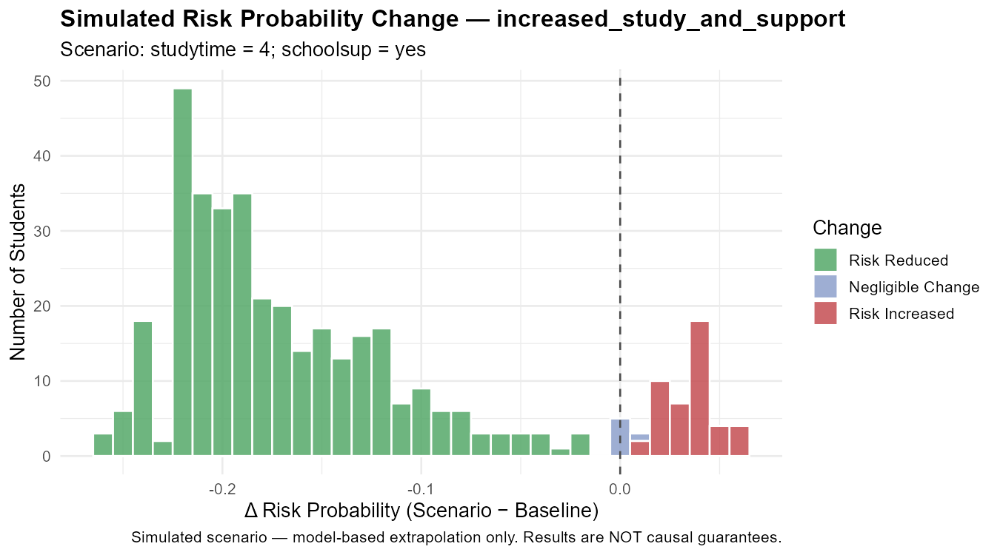
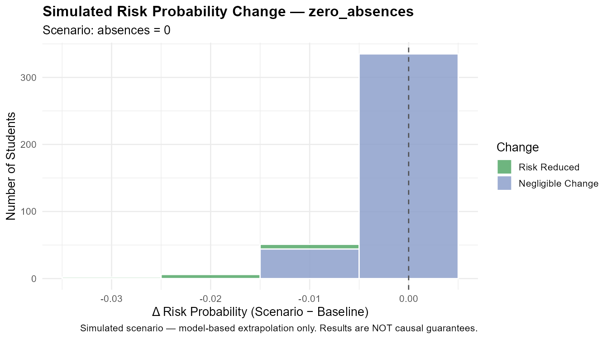

```{r}
#| label: setup
#| include: false
source("R/scenario_analysis.R")

# Scenario 1: Increase study time + add school support
s1 <- scenario_analysis(
  scenario = list(studytime = 4, schoolsup = "yes"),
  label    = "increased_study_and_support"
)

# Scenario 2: Reduce all absences to zero
s2 <- scenario_analysis(
  scenario = list(absences = 0),
  label    = "zero_absences"
)
```

## Overview

This section simulates **what-if interventions** by modifying actionable
student variables and re-predicting risk through the trained logistic regression
model. For each scenario, we compare baseline vs. simulated risk probabilities
and count how many students would transition from At Risk to Low Risk.

> **Simulated results only:** These projections are model-based extrapolations.
> They assume no other factors change and do not account for implementation
> feasibility or individual circumstances.

---

## Scenario 1: Increased Study Time + School Support

*What if every student studied ≥ 10 hours/week (studytime = 4) and received
school support (schoolsup = yes)?*

```{r}
#| label: s1-summary
n1_improved    <- sum(s1$delta_prob < -0.01)
n1_transitioned <- sum(s1$class_changed & s1$baseline_class == "At Risk" &
                       s1$scenario_class == "Low Risk")
cat(sprintf(
  "Scenario 1 Results:\n  Students with reduced risk probability: %d\n  Students transitioning At Risk -> Low Risk: %d\n  Mean change in risk probability: %.4f",
  n1_improved, n1_transitioned, mean(s1$delta_prob)
))
```

```{r}
#| label: s1-plot
#| fig-cap: "Scenario 1: Change in risk probability (studytime = 4, schoolsup = yes)"

```

---

## Scenario 2: Perfect Attendance (Absences = 0)

*What if every student had zero absences?*

```{r}
#| label: s2-summary
n2_improved    <- sum(s2$delta_prob < -0.01)
n2_transitioned <- sum(s2$class_changed & s2$baseline_class == "At Risk" &
                       s2$scenario_class == "Low Risk")
cat(sprintf(
  "Scenario 2 Results:\n  Students with reduced risk probability: %d\n  Students transitioning At Risk -> Low Risk: %d\n  Mean change in risk probability: %.4f",
  n2_improved, n2_transitioned, mean(s2$delta_prob)
))
```

```{r}
#| label: s2-plot
#| fig-cap: "Scenario 2: Change in risk probability when absences = 0"

```

---

## Comparison of Scenarios

```{r}
#| label: scenario-comparison
scenario_summary <- data.frame(
  Scenario               = c("Increased Study + School Support", "Zero Absences"),
  Students_Improved      = c(sum(s1$delta_prob < -0.01), sum(s2$delta_prob < -0.01)),
  At_Risk_Transitioned   = c(
    sum(s1$class_changed & s1$baseline_class == "At Risk"),
    sum(s2$class_changed & s2$baseline_class == "At Risk")
  ),
  Mean_Delta             = round(c(mean(s1$delta_prob), mean(s2$delta_prob)), 4)
)
knitr::kable(scenario_summary,
             col.names = c("Scenario", "Students with ↓ Risk",
                           "At Risk → Low Risk", "Mean Δ Probability"),
             caption = "Summary comparison of simulated scenarios")
```

> These comparisons highlight which intervention *type* has greater modelled
> impact — not which is more feasible to implement. Always consult educators
> and counsellors before designing actual interventions.

---

*Continue to [Validation & Limitations](validation-limitations.qmd) for critical discussion.*
