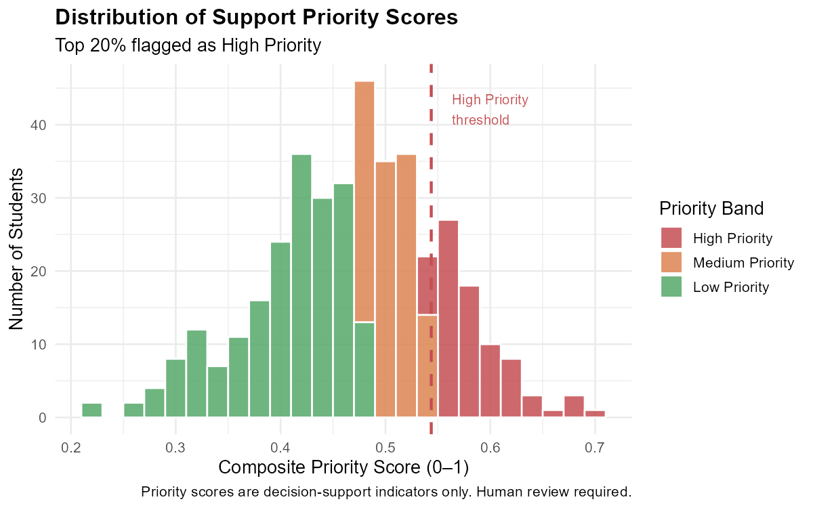

```{r}
#| label: setup
#| include: false
source("R/rank_support_priority.R")
ranking <- rank_support_priority()
```

## Overview

This section generates a **Support Priority Ranking** — an ordered list of
students by their estimated need for academic support. The ranking combines
the model's predicted risk probability with auxiliary indicators (past failures,
absences, and study time) into a single composite score.

> **Decision-support only:** Priority scores are indicators to assist counsellors,
> not automated gates. All students identified as High Priority should be
> reviewed individually before any intervention.

---

## How the Score is Computed

| Component | Weight | Source |
|---|---|---|
| Predicted risk probability | 50% | Logistic regression model |
| Past failures (normalised 0–1) | 25% | `failures` / 3 |
| Absence rate (normalised 0–1) | 15% | `absences` / 95th percentile |
| Study time deficit (inverted) | 10% | 1 − (`studytime` − 1) / 3 |

---

## Priority Distribution

```{r}
#| label: dist-plot
#| fig-cap: "Distribution of composite priority scores. Red dashed line = High Priority threshold (top 20%)."

```

---

## Priority Band Summary

```{r}
#| label: band-summary
band_tbl <- as.data.frame(table(ranking$priority_band))
band_tbl$Percentage <- round(100 * band_tbl$Freq / nrow(ranking), 1)
knitr::kable(band_tbl, col.names = c("Priority Band", "N", "%"),
             caption = "Student counts by priority band")
```

---

## Top 20 Students by Priority (Anonymised)

```{r}
#| label: top-students
top20 <- head(ranking[, c("rank", "priority_score", "risk_probability",
                           "failures", "absences", "studytime",
                           "priority_band", "actual_at_risk")], 20)
knitr::kable(top20,
             col.names = c("Rank", "Priority Score", "Risk Prob.",
                           "Failures", "Absences", "Study Time",
                           "Band", "Actual Status"),
             caption = "Top 20 students by support priority (anonymised indices)",
             digits = 4)
```

> Student indices are anonymised row numbers — no personal identifiers are stored or displayed.

---

*Continue to [Scenario Analysis](scenario-analysis.qmd) to simulate intervention effects.*
